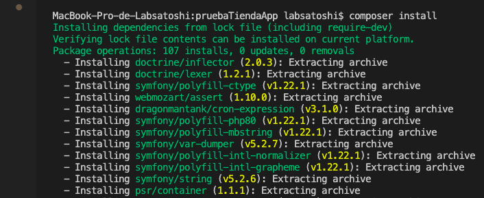
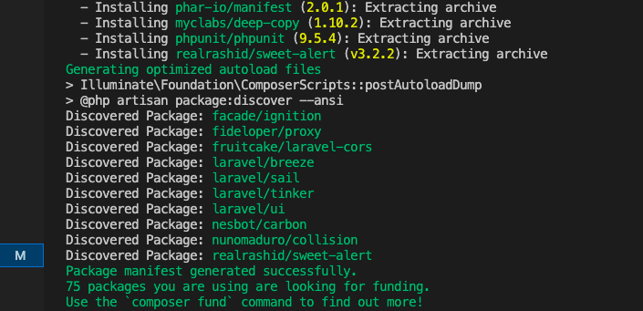
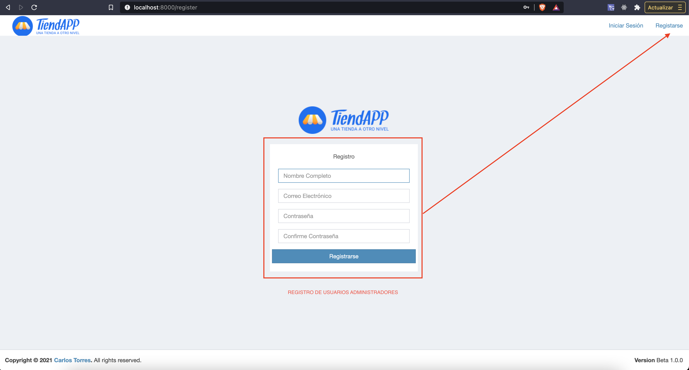
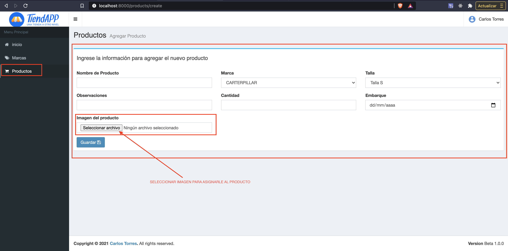

# Prueba de Desarrollo
## Instrucciones 

Mediante el uso de Laravel y MySQL, desarrollar una aplicación que permita la administración de un catálogo de productos.

Debe contener la siguiente información y características:

# 1. Marca
*   Nombre de la marca
*   Referencia (identificador, puede ser numérico o alfanumérico, especificar el utilizado)

# 2. Producto
*   Nombre del producto
*   Talla (S, M, L)
*   Observaciones
*   Marca del producto
*   Cantidad en inventario
*   Fecha de embarque

# 3. El desarrollo debe contar con:
*   Datos persistentes en la aplicación
*   Formulario de Creación de nuevos productos
*   Formulario de Edición de productos
*   Formulario de Creación de nuevas marcas
*   Formulario de Edición de marcas
*   Capacidad de eliminar productos
*   Capacidad de eliminar marcas

# 4. Información adicional
*   Los formularios deben tener validaciones de acuerdo al tipo de campo.
*   Todos los campos son obligatorios.

Debe entregarse los archivos fuente (html, js, css, etc.), puede hacerse mediante acceso a un repositorio o un zip al correo.

En caso de hacer uso de alguna librería o algún desarrollo previo, por favor comunicarlo e indicarn qué ayuda le prestó en el momento de la programación y la forma en que lo asoció a esta prueba.

# Instalacion:

* Clonar el repositorio

    
    
    

* Ejecutar composer para las dependecias de php: composer install

    
    
* Configurar el archivo .env con la configuracion de la base de datos

    

* Ejecutar las migraciones: php artisan migrate

    

* Configurar el App Key: php artisan key:generate

    

* Configurar el link simbolico para el almacenamiento de imagenes: php artisan storage:link

    

* Correr el servidor local: php artisan server

    

# Uso del Aplicativo

* Ingresar a la url del servidor: http://localhost:8000

    

* Registrar un usuario

    

* Iniciar Sesión con el usuario registrado anteriormente para acceder al panel adminstrativo

    

* Panel administrativo

    
    

* Registrar las marcas deseadas (Menu de Marcas)

    
    
    

* Registrar los productos deseados (Menu de Productos)

    
    
    

* Navegar hasta la pagina principal (Tienda)(Click Icono de "TiendApp")

    

* Verificar los Productos registrados...

    
